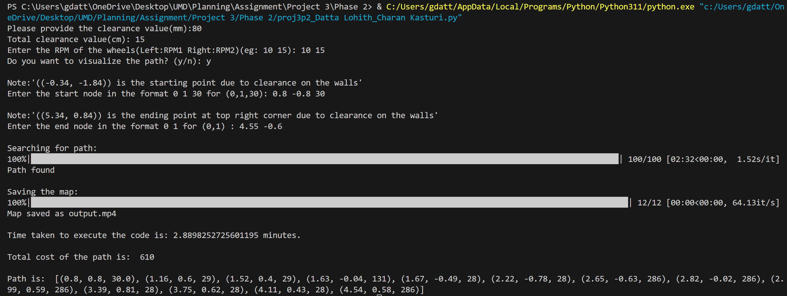
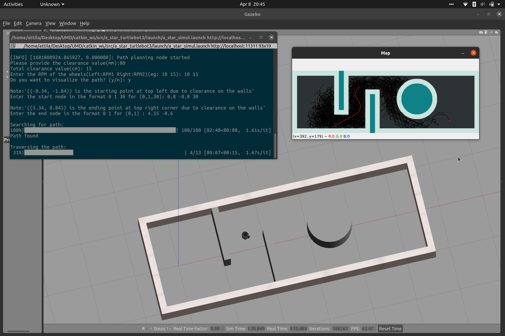

## ENPM661: Planning for Autonomous Robots

## Project Members
- Venkata Sai Sricharan Kasturi - UID: 119444788
- Datta Lohith Gannavarapu - UID: 119455395

## Contents

- Terminal-Output.png
- Simulation-output.png

### Part-1 folder
-------------
- A_star.py

### Part-2 folder
-------------
- a_star_turtlebot3 (ros package)
    - launch (folder)
        - a_star_simul.launch
    - src(folder)
        - a_star_path_ros.py
    - world(folder)
        - map.world
    - CmakeLists
    - package.xml
   

## Prerequisties
- Ubuntu 20.04 LTS
- ROS noetic
- Gazebo11
- Turtlebot3 Packages

## Dependencies
- python 3.8
- Visual studio code

## Libraries
- Part 1
    - import numpy as np
    - import time
    - import cv2 as cv
    - import heapq
    - from tqdm import tqdm
    - import math
- Part 2
   - import rospy
   - import numpy as np
   - from geometry_msgs.msg import Twist
   - from gazebo_msgs.srv import SetModelState
   - from gazebo_msgs.msg import ModelState
   - import time
   - from tf.transformations import quaternion_from_euler
   - import cv2 as cv
   - import heapq
   - from tqdm import tqdm
   - import math

## Workspace and Turtlebot(paste the following commands line by line)
    $ mkdir catkin_ws/src
    $ cd catkin_ws
    $ catkin_make
    $ source catkin_ws/src/devel/setup.bash
    $ cd catkin_ws/src
    $ git clone https://github.com/ROBOTIS-GIT/turtlebot3.git
    $ git clone https://github.com/ROBOTIS-GIT/turtlebot3_msgs.git
    $ git clone https://github.com/ROBOTIS-GIT/turtlebot3_simulations.git
    $ cd  ../ && catkin_make

## How to run the code

- Download the zip file and extract it to your work space
- Install Python 3 and the libraries mentinoned above
- Part 1
    - Run the A_star.py and give coordinates to visualize and save the path
- Part 2
    - Setup the workspace and install the necessary libraries mentioned
    - Run the following command to run the simulation

            $ roslaunch a_star_turtlebot3 a_star_simul.launch

    - Give clearance, rpm1,rpm2, start node and end node based on the conditions mentioned in the terminal( You can use the test case given below )

            -> clearance : 80
            -> (RPM1,RPM2) : (10 15)
            -> animation : y
            -> Start Point : 0.8 -0.8 30
            -> End point : 4.55 -0.6
    - Watch the simulation 

## Sample output
- Terminal Output 

 

- Simulation Sample Output 

 

## Results

- Video output of the path explored with explored nodes for part 1 

- Gazebo Simulation - Video output of simulation of turtlebot3 burger in a gazebo environment 

